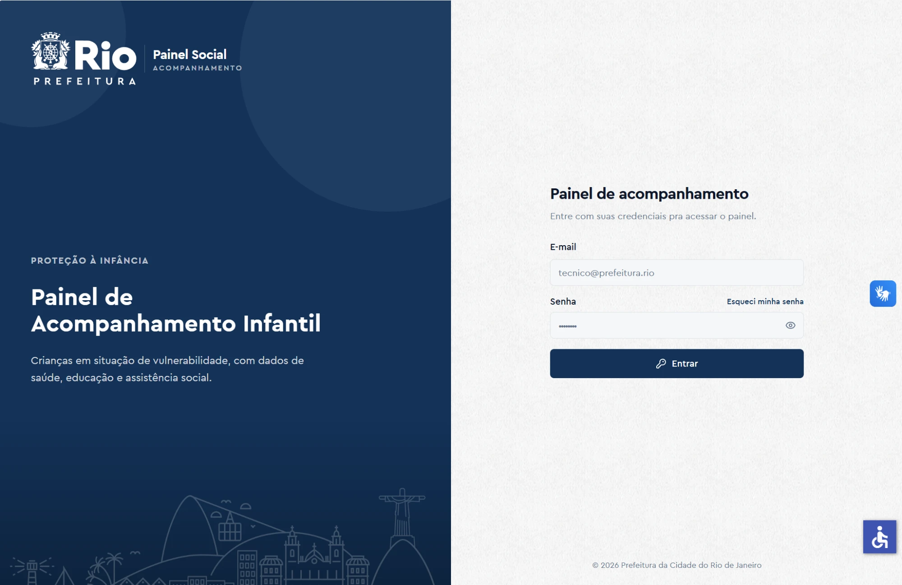
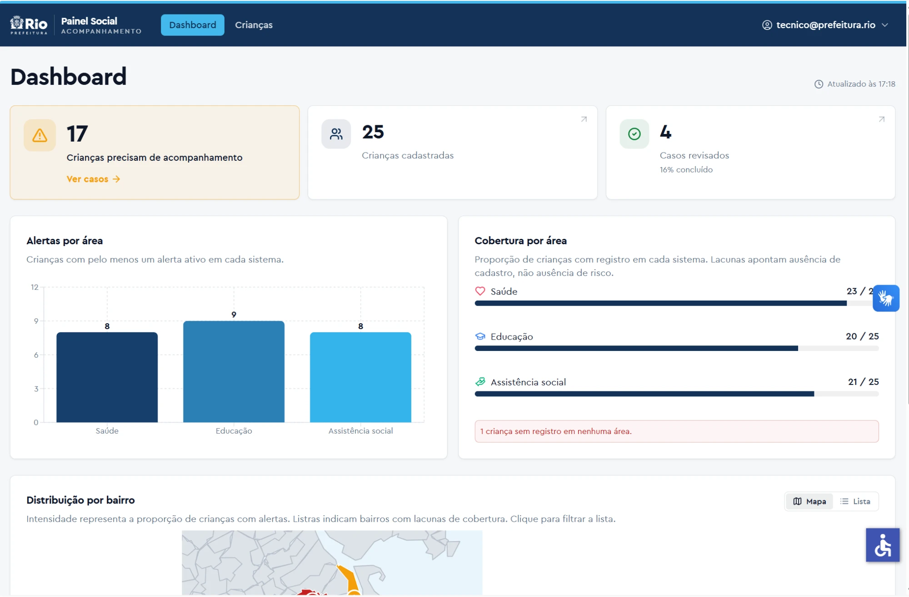
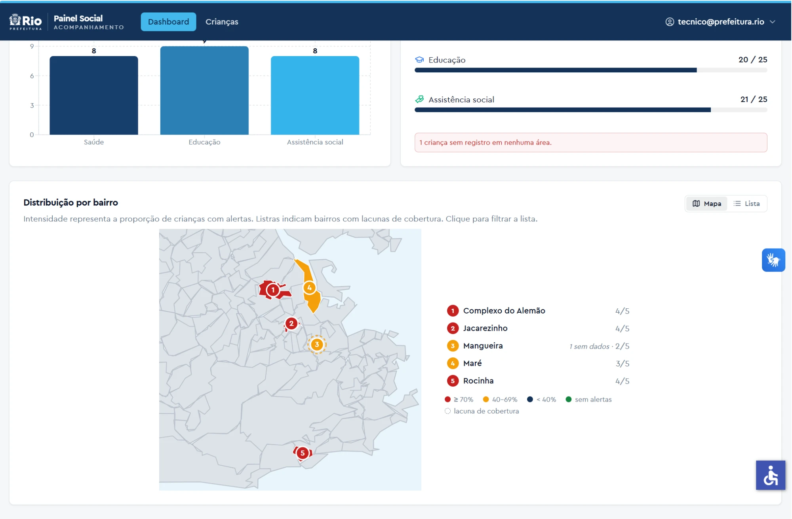
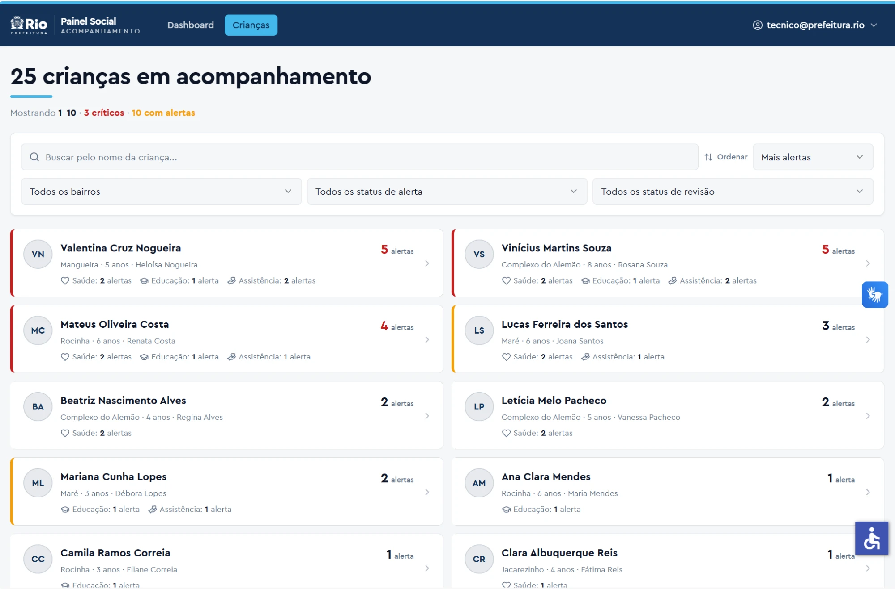
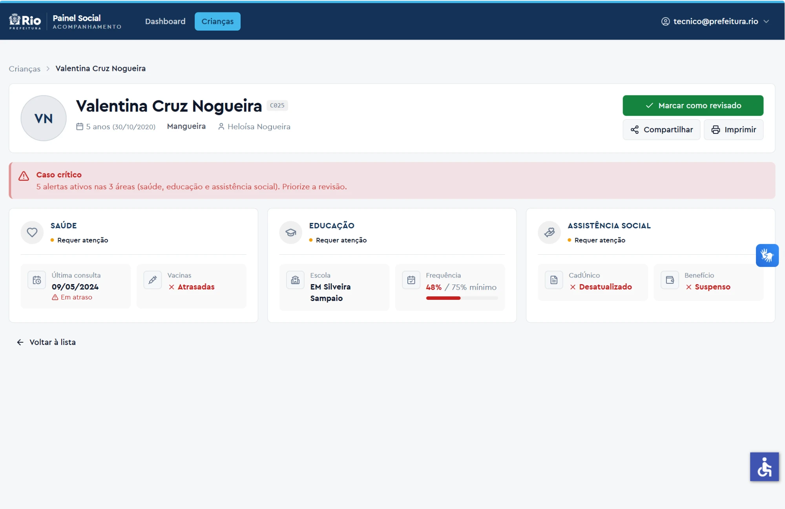

# Painel de Acompanhamento — PCRJ

Painel para os técnicos da Prefeitura acompanharem crianças em situação de vulnerabilidade social, cruzando dados de saúde, educação e assistência social. É um monorepo: API em Fastify e frontend em Next.js.

## TL;DR

- **Ver no ar:** [painel-social-pcrj.vercel.app](https://painel-social-pcrj.vercel.app/), entrando com `tecnico@prefeitura.rio` / `painel@2024`.
- **Rodar local:** `docker compose up` e abrir [localhost:3000](http://localhost:3000) com as mesmas credenciais.
- **Como é montado:** monorepo com API em Fastify e site em Next.js. O login fica num cookie que o JavaScript da página não consegue ler, e quem fala com a API é o servidor do Next, não o navegador.
- **Onde mora o dado:** tudo no Postgres, cada criança guardada como um documento JSON. Filtro, ordenação e os números do dashboard saem de uma única regra escrita em TypeScript — a mesma que os testes usam.
- **O que cuidei além do básico:** deixei as decisões e o porquê de cada uma escritas aqui embaixo, tem teste nos três níveis (regra, API e navegador) e o painel funciona só no teclado e em tela de celular.

## Índice

- [Telas](#telas) · [Como rodar](#como-rodar) · [Stack](#stack) · [API](#api)
- [Decisões e trade-offs](#decisões-e-trade-offs) · [Testes](#testes) · [O que faria diferente](#o-que-faria-diferente-com-mais-tempo)

## Telas

| Login | Dashboard |
|---|---|
|  |  |

| Distribuição por bairro | Lista de crianças |
|---|---|
|  |  |

| Detalhe da criança |
|---|
|  |

## Como rodar

```bash
git clone https://github.com/willlucas1512/desafio-fullstack-pleno.git
cd desafio-fullstack-pleno
docker compose up
```

Abre [http://localhost:3000](http://localhost:3000) e loga. Se a porta 3000 estiver ocupada, `WEB_HOST_PORT=3010 docker compose up`.

### Credenciais de teste

- E-mail: `tecnico@prefeitura.rio`
- Senha: `painel@2024`

### Sem Docker

Você vai precisar de um Postgres rodando. O jeito mais fácil é subir só o banco do compose:

```bash
docker compose up -d db
npm install
npm run dev:api   # 3001
npm run dev:web   # 3000
```

Os defaults do `docker-compose.yml` e do `apps/api/.env.example` já batem com as credenciais acima. Pra rodar a API direto pelo Node, copie `apps/api/.env.example` para `apps/api/.env`.

## Stack

| Camada | Escolha | Por quê |
|---|---|---|
| Backend | Node.js 22 + Fastify + TypeScript | Mesma linguagem do front, então dá pra compartilhar os tipos de domínio, e o Fastify já traz validação de schema. Go renderia um binário menor, mas nessa escala isso não muda nada. |
| Persistência | Postgres | Fonte única durável; o seed carrega no primeiro boot e as revisões sobrevivem a reinícios. |
| Frontend | Next.js 15 (App Router) + React 18 | Especificado no enunciado. |
| UI | Tailwind + shadcn/ui | Componentes copiados pro projeto, sem upgrade surpresa quebrando layout. |
| Estado de servidor | TanStack Query | Cache e invalidação por feature. |
| Formulários | react-hook-form + Zod | Zod já é usado no back, então a validação é a mesma stack dos dois lados. |
| Gráficos | Recharts | |
| Infra | Docker Compose (multi-stage) | `docker compose up` sobe tudo do zero. |

## API

Base: `http://localhost:3001`. Os únicos endpoints públicos são `POST /auth/token` e `GET /health`. Todo o resto exige `Authorization: Bearer <token>` e devolve `401` sem token ou com token expirado. Tem Swagger interativo em `/docs`, atrás de HTTP Basic com as mesmas credenciais.

| Método | Rota | O que faz |
|---|---|---|
| `POST` | `/auth/token` | Autentica e retorna `{ access_token, token_type }`. O JWT inclui `preferred_username` com o e-mail. `401` em credencial errada. |
| `POST` | `/auth/refresh` | Troca um JWT ainda válido por um novo com `exp` renovado (sliding session). Requer Bearer. |
| `GET` | `/children` | Lista paginada com filtros `bairro`, `alertas` (`com`/`sem`/`saude`/`educacao`/`assistencia_social`) e `revisado`. `page` e `pageSize` (default 1 / 10). |
| `GET` | `/children/:id` | Detalhe completo da criança, `404` se não existe. |
| `GET` | `/children/neighborhoods` | Lista de bairros distintos, usada pelo filtro do front. |
| `GET` | `/summary` | Agrega o dashboard: totais, alertas por área, cobertura por área, distribuição por bairro e contagem de revisados. |
| `PATCH` | `/children/:id/review` | Marca como revisado (`revisado_por` = e-mail do JWT, `revisado_em` = timestamp). Requer Bearer. |
| `DELETE` | `/children/:id/review` | Desfaz a revisão do caso. Requer Bearer. |
| `GET` | `/children/:id/review-history` | Trilha de auditoria append-only das revisões (mais recente primeiro). Requer Bearer. |

No `/summary` eu separo `sem_dados` de `sem_alertas` de propósito: uma criança sem nenhum dado nas três áreas (c015) é uma coisa, uma que foi verificada e não tem alertas é outra.

## Decisões e trade-offs

### Postgres como fonte única, regra de negócio em TypeScript

Cada criança é um documento `JSONB` na tabela `children`, só `id` + `data`. O Postgres entra pela durabilidade: guarda o estado e mantém as revisões entre reinícios. Mas filtro, ordenação, paginação e agregação **não** rodam em SQL. O repositório carrega as crianças e passa o trabalho pra uma definição única em `domain/`, que é a mesma lógica que o store fake dos testes consome. São 25 registros, então processar em memória sai de graça, e a regra de negócio fica num lugar só, fácil de testar, sem ter que reescrever em SQL e correr o risco das duas versões divergirem.

Sei o custo disso: `por_bairro` e a listagem de bairros varrem tudo, então com dezenas de milhares de crianças ia pesar. Por isso o acesso ao dado passa pela interface `ChildrenStore`. Quando o volume justificar, é só escrever uma segunda implementação que empurre o trabalho pro SQL, sem encostar em services nem rotas. E como a criança inteira mora num `JSONB`, o schema Zod (`domain/child.ts`) é a única definição do registro: adicionar um campo é mudança só no domínio, sem DDL nem mapeamento de coluna.

### Auth: cookie httpOnly atrás de um BFF

O token de login não fica acessível pro JavaScript da página. Ele vai num cookie marcado como `HttpOnly`, então mesmo que entrasse um XSS no app, o atacante não conseguiria ler o token e se passar pelo técnico. Pra isso funcionar, o navegador nunca conversa direto com a API: ele chama o próprio Next, que lê o cookie no servidor e repassa a requisição pra API já com o token no cabeçalho. Esse intermediário (um BFF) ainda ajuda no deploy, que está dividido entre Vercel e Render — como o cookie é do mesmo domínio do site, ele continua valendo, e a API só recebe chamada vinda do servidor, nunca do browser.

Quem realmente barra acesso é a API: ela exige token em todo endpoint de dados. No front é só conforto: antes de desenhar uma página protegida, o app olha o cookie e, se já estiver vencido, manda direto pro login (guardando pra onde a pessoa queria ir), pra não piscar uma tela que ela nem vai poder ver. E se o token vence no meio do uso, o primeiro erro de autorização que a API devolver derruba o cookie e leva de volta pro login.

### Dados parciais e divergentes

Nem toda criança tem dado nas três áreas, e o seed ainda traz casos em que o dado bruto e o alerta curado se contradizem. Trato isso com duas regras:

- **Área sem dado não vira campo em branco.** Quando saúde, educação ou assistência vêm `null`, o card mostra um vazio explícito em vez de simplesmente sumir da tela.
- **O alerta ganha do dado bruto** quando os dois falam do mesmo atributo. A c025, por exemplo, tem `cad_unico: false` (cadastro ausente) e ao mesmo tempo o alerta `cadastro_desatualizado` (existe, só venceu). Mostrar "Ausente" e "Desatualizado" lado a lado seria contraditório, então o painel exibe só "Desatualizado", que é o status acionável. Essa decisão fica num helper puro e testado. A única exceção é o medidor de frequência: como ele mostra o número e o mínimo juntos na tela ("73% / 75%"), a cor segue o que está visível, senão ficaria verde com 73 < 75.

### Configuração e segurança

- Os defaults do `docker-compose.yml` batem com o enunciado pra `docker compose up` rodar sem nenhum setup. A única exceção é o `JWT_SECRET`: ele não tem default. Se vier vazio, o entrypoint gera um aleatório, e em produção a app se recusa a subir com o placeholder.
- A API tem um limite de requisições por minuto, bem mais baixo no login pra dificultar quem fica chutando senha. A conferência da senha leva sempre o mesmo tempo, pra não vazar pelo relógio se o e-mail existe. O resto é o feijão com arroz: cabeçalhos de segurança no HTTP, consultas ao banco sempre parametrizadas (sem montar SQL na mão) e o redirecionamento pós-login preso a caminhos internos, pra ninguém usar o `?next=` pra jogar a pessoa num site de fora.
- Não dá pra revogar um token. Ele vale por 1h e a sessão se renova sozinha enquanto a pessoa está usando, mas não existe uma lista de "esse token foi cancelado". Pra um painel interno, achei que valia a pena ficar simples.

Tem uma ressalva que eu já conheço: o widget de acessibilidade VLibras injeta scripts inline e obriga a CSP do front a aceitar `'unsafe-inline'`/`'unsafe-eval'`, o que enfraquece essa camada. O estrago fica contido porque a sessão mora no cookie httpOnly (um XSS não levaria o token), mas o certo seria isolar o VLibras num iframe sandboxed pra voltar a ter CSP estrita no resto do app.

## Testes

Tem teste nos três níveis. No back, o Vitest checa desde a regra isolada (login, filtro, paginação, soma do dashboard) até a rota inteira respondendo, e os testes do banco rodam contra um Postgres real subido num container, não num mock. No front, os componentes são testados com Testing Library. E o Playwright faz o caminho completo no navegador: entrar, filtrar, marcar um caso como revisado e ver o retorno, andar só pelo teclado e conferir a tela num celular estreito.

```bash
npm test --workspaces
npm run test:e2e --workspace=apps/web
```

## O que faria diferente com mais tempo

1. Refresh token rotativo de verdade. Hoje a sliding session renova o JWT (`exp` de 1h) enquanto a aba fica aberta, mas não existe um refresh token separado de vida longa nem rotação, então fechar a aba por mais de 1h ainda obriga a logar de novo.
2. Isolar o VLibras num iframe sandboxed pra tirar `'unsafe-inline'`/`'unsafe-eval'` da CSP do resto do app.
3. Deixar mais leve pra celular fraco. O técnico usa o painel o dia todo, muita vez num aparelho simples e com rede ruim, então o que mais incomoda é o tempo até a tela aparecer. Hoje o gráfico e o mapa já vêm no primeiro carregamento, mesmo que a pessoa nem chegue a olhar pra eles — dava pra carregar os dois só quando precisam e deixar o servidor montar a primeira tela de dados, em vez de mandar uma tela vazia que vai buscar tudo depois. Antes de sair mexendo, eu mediria onde dói (com o Lighthouse simulando rede e processador lentos) pra atacar o que pesa de verdade.
4. Uma tela dedicada de cobertura, listando os casos sem dados ordenados por número de áreas faltantes.
5. Enxergar o que acontece em produção: erro do front caindo num painel (tipo Sentry) e métricas de tempo de resposta no back. O registro de quem revisou o quê e quando já existe (em `GET /children/:id/review-history`); o que falta é a parte de monitoramento.
